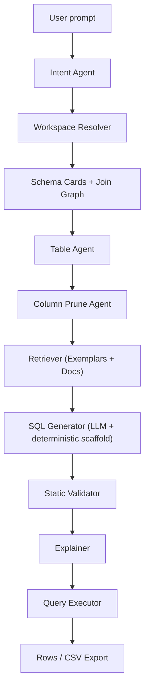
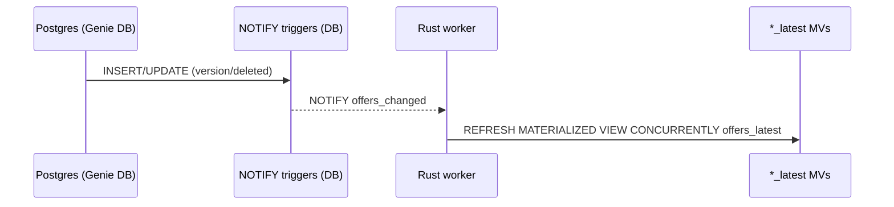

# Genie DB — QueryGPT-Style Text-to-SQL System (Expanded + Rust Code Map)
## Component interactions, workflow example, and where each piece lives in the repo

_Last updated: 2025-12-17_

This document expands the “QueryGPT full design” and explicitly maps each conceptual component to the **Rust repo skeleton** you generated (`genie-querygpt-rust-repo-skeleton.zip`). It also explains the purpose of the modules that are currently stubs (no real logic yet), so you can implement them systematically.

> Assumptions:
> - Genie DB entities are versioned by `(id, profile, version)`.
> - Latest MVs exist: `offers_latest`, `campaigns_latest`, `products_latest`, `discounts_latest`, `skus_latest`.
> - `*_latest` includes deleted-as-latest (no filtering). Filter out deleted at query time if needed.
> - Version ownership differs across satellites/link tables (especially `campaign_offers`).

---

## 0) Repo overview

### Workspace layout
```
.
├── Cargo.toml                         # workspace
├── crates/
│   ├── querygpt-core/                 # all logic: schema, agents, validation, explanation
│   ├── querygpt-server/               # HTTP API (Axum)
│   └── querygpt-worker/               # LISTEN/NOTIFY refresher for *_latest MVs
└── config/
    └── workspaces/
        ├── campaigns_offers.index.json
        ├── campaigns_offers.schema_cards.json
        └── campaigns_offers/
            └── exemplars/
                └── prepaid_apac_export.sql
```

### Key “entry points” in code
- **HTTP server**: `crates/querygpt-server/src/main.rs`
- **Core library module root**: `crates/querygpt-core/src/lib.rs`
- **MV refresh worker**: `crates/querygpt-worker/src/main.rs`
- **Schema Cards config**: `config/workspaces/campaigns_offers.schema_cards.json`

---

## 1) Running example (used throughout)

### User request (natural language)
> Export all Campaigns that have Pre-Paid offers. Put Partnership ID in the first column. Include Campaign ID + Campaign Name + Offer ID + Offer Name + Product(s) + PackageId + Country(s). Countries are APAC only (KR, JP, TW, SG, HK). Include Offers that are Published or Expired, and show “Expired or Live” based on end_date.

### Genie DB correctness constraints
- Offer head data → `offers_latest`
- Campaign head data → `campaigns_latest`
- Offer satellites join on offer version:
  - `offer_phases` join `(offer_id, profile, version)`
  - `offer_products` join `(offer_id, profile, version)`
- Link table `campaign_offers` join rule:
  - `campaign_offers.version` aligns to **campaign** version
  - join: `campaign_offers.version = campaigns_latest.version`

---

## 2) System interaction diagrams

### 2.1 End-to-end pipeline (conceptual)


### 2.2 Ops / freshness (MVs)


---

## 3) Component-to-code mapping (the big table)

| Component | Purpose | Primary Code Location(s) | Current State |
|---|---|---|---|
| Workspace Resolver | Select workspace config and load schema cards | `querygpt-core/schema/registry.rs` | **Implemented loader** (basic) |
| Schema Cards | Structured schema/joins/derived fields | `querygpt-core/schema/cards.rs`, `config/workspaces/*.schema_cards.json` | **Data exists**, structs exist |
| Join Graph | Enforce allowed joins and version-safe edges | `querygpt-core/schema/join_graph.rs` | **Helper stubs** (edge lookup, safe check) |
| Intent Agent | Classify prompt to workspace/task/filters | `querygpt-core/agents/intent.rs` | **Stub** |
| Table Agent | Pick tables + build join plan | `querygpt-core/agents/table.rs` | **Stub with hardcoded plan** |
| Column Prune Agent | Reduce schema/context for LLM | `querygpt-core/agents/column_prune.rs` | **Stub** |
| Retriever (RAG) | Retrieve exemplars/patterns | `querygpt-core/rag/retrieval.rs` | **Stub** |
| Prompt Builder | Build LLM prompt from scaffold + exemplars | `querygpt-core/rag/prompt.rs` | **Stub** |
| SQL Renderer | Deterministic scaffold + LLM fill | `querygpt-core/sql/render.rs` | **Stub** |
| Validator | Read-only + join/column checks | `querygpt-core/validate/static_check.rs`, `querygpt-core/policy/rules.rs` | **Parser check only + stub policy** |
| Explainer | Human-readable explanation of SQL | `querygpt-core/explain/explain.rs` | **Stub** |
| Server API | HTTP endpoints to generate/validate/execute | `querygpt-server/src/main.rs` | **Minimal /generate stub** |
| Worker | LISTEN/NOTIFY and refresh *_latest MVs | `querygpt-worker/src/main.rs` | **Implemented skeleton** |
| Telemetry | Logging/metrics scaffolding | `querygpt-core/telemetry/mod.rs` | **Stub** |

---

## 4) Detailed walkthrough: our example request through the code

This section shows what happens *today* in the skeleton and what each module should eventually do.

### Step A — API receives request
**Code:** `crates/querygpt-server/src/main.rs`

- Endpoint: `POST /generate`
- Parses JSON `{ "user_prompt": "..." }`
- Calls intent classifier: `querygpt_core::agents::intent::classify(...)`
- Loads schema registry (currently hardcoded path)
- Returns stubbed SQL/explanation

**What to implement next**
- Add a config setting for workspace index path
- Add a second endpoint `/execute` to run SQL (read-only)

---

### Step B — Intent Agent classifies prompt
**Code:** `crates/querygpt-core/src/agents/intent.rs`

**Current behavior**
- Returns a hardcoded workspace and task.

**Target behavior**
- Output something like:
  - workspace: `campaigns_offers`
  - task: `export`
  - filter hints: `phase_type=PREPAID`, `countries=[KR,JP,TW,SG,HK]`, `status in (...)`
  - requested fields: partnership_id first, etc.

**Implementation notes (Rust)**
- Phase 1: rules/keyword maps
- Phase 2: embedding classifier (optional)
- Keep it deterministic and explainable (log which rule matched)

---

### Step C — Workspace Resolver loads Schema Cards
**Code:** `crates/querygpt-core/src/schema/registry.rs`

**Current behavior**
- Loads an index JSON (`*.index.json`)
- Loads Schema Cards JSON referenced by that index

**Target behavior**
- Choose workspace index path dynamically based on intent output
- Maintain a registry cache (in-memory) to avoid re-reading files per request

---

### Step D — Table Agent chooses tables + builds join plan
**Code:** `crates/querygpt-core/src/agents/table.rs`

**Current behavior**
- Returns a hardcoded `TablePlan` with joins for the campaigns/offers use-case.

**Target behavior**
- Use Schema Cards Join Graph to:
  - select minimal set of entities needed to satisfy requested fields + filters
  - produce join edges that are marked safe
  - enforce version semantics:
    - offer satellites: `... AND version = offers_latest.version`
    - campaign_offers to campaigns_latest: `co.version = c.version`

**How to implement**
- Convert Join Graph to adjacency map
- Run a shortest-path / Steiner tree style selection:
  - Required nodes: those containing requested fields/filters
  - Add intermediary nodes needed for connectivity
- Output deterministic join recipe (aliases + ON predicates)

**Related helper**
- `crates/querygpt-core/src/schema/join_graph.rs`:
  - `assert_edge_safe(cards, from, to)` should be used here to block “unknown joins”.

---

### Step E — Column Prune Agent reduces schema context
**Code:** `crates/querygpt-core/src/agents/column_prune.rs`

**Current behavior**
- Stub

**Target behavior**
- Given:
  - TablePlan entities and joins
  - requested output fields
  - filter hints
- Compute:
  - per-entity columns required
  - JSON paths required (`attributes.packageId`, `legacy.phase_type`)
  - derived fields required (`expired_or_live_status`)

**Why it matters**
- Token cost down
- Model mistakes down
- Prompts become stable and testable

---

### Step F — Retriever fetches exemplars (RAG)
**Code:** 
- `crates/querygpt-core/src/rag/retrieval.rs`
- Exemplars in `config/workspaces/<ws>/exemplars/*.sql`

**Current behavior**
- Stub returns empty list

**Target behavior**
- Return 2–4 exemplar SQL snippets most similar to the request:
  - matching on tags, keywords, and entity usage
- Phase 1: keyword + BM25 on local files
- Phase 2: vector embeddings stored in a small local index or DB table

---

### Step G — Prompt Builder formats the LLM instruction
**Code:** `crates/querygpt-core/src/rag/prompt.rs`

**Current behavior**
- Stub

**Target behavior**
- Build a prompt that includes:
  - strict join recipe from TablePlan (aliases + ON clauses)
  - pruned schema cards (only needed columns)
  - derived fields definitions
  - exemplar SQL snippets
  - hard rules: “do not add tables”, “do not add joins”, “read-only”

---

### Step H — SQL renderer builds deterministic scaffold and/or invokes LLM
**Code:** `crates/querygpt-core/src/sql/render.rs`

**Current behavior**
- Stub

**Target behavior**
- Deterministic parts:
  - FROM/JOIN blocks (non-negotiable)
  - alias assignment
- LLM-filled parts:
  - SELECT list ordering (partnership first)
  - WHERE clauses and filter composition
  - GROUP BY and ORDER BY

---

### Step I — Validator blocks unsafe/incorrect SQL
**Code:** 
- `crates/querygpt-core/src/validate/static_check.rs`
- `crates/querygpt-core/src/policy/rules.rs`

**Current behavior**
- Only verifies SQL parses with `sqlparser`.

**Target behavior**
- Disallow writes/DDL
- Allow only workspace entities
- Validate joins match Join Graph edges
- Enforce version semantics (offer satellites vs campaign links)
- Enforce LIMIT (unless export mode)

---

### Step J — Explainer produces user-facing explanation
**Code:** `crates/querygpt-core/src/explain/explain.rs`

**Current behavior**
- Returns “Explanation TBD”

**Target behavior**
- Explain tables, filters, and derived fields
- Explain why `campaign_offers.version = campaigns_latest.version` is required
- Provide a short “how to tweak” section

---

### Step K — Execution (not implemented in skeleton)
**Suggested approach**
- Add `querygpt-core/executor/` or implement in `querygpt-server` with a DB client.
- Use a read-only DB role + timeout + streaming.

---

## 5) Module-by-module: what each stub is for

### `querygpt-core/schema/cards.rs`
Defines structs for Schema Cards JSON (entities, columns, json paths, join graph, derived fields).

### `querygpt-core/schema/registry.rs`
Loads workspace index and Schema Cards JSON. Ideal place to add caching and hot-reload later.

### `querygpt-core/schema/join_graph.rs`
Join graph helper functions. Use this in Table Agent + Validator so joins are never “invented”.

### `querygpt-core/dsl/report_spec.rs`
Defines a structured report spec (future YAML/JSON). Lets you bypass LLM ambiguity for repeatable reports.

### `querygpt-core/dsl/compile.rs`
Compiles ReportSpec into an intermediate plan (tables/joins/fields/predicates). This is your correctness backbone.

### `querygpt-core/agents/intent.rs`
Maps natural language to structured intent: workspace/task/filters/fields.

### `querygpt-core/agents/table.rs`
Builds a version-safe table/join plan. This is the most important correctness gate in Genie DB.

### `querygpt-core/agents/column_prune.rs`
Finds minimal required columns and JSON paths for the prompt to reduce token cost and mistakes.

### `querygpt-core/rag/retrieval.rs`
Retrieves exemplar SQL patterns. Start with keyword/BM25, later add embeddings.

### `querygpt-core/rag/prompt.rs`
Builds the LLM prompt with strict constraints, schema context, join recipe, exemplars, and derived fields.

### `querygpt-core/sql/render.rs`
Renders SQL deterministically (joins) and optionally lets the LLM fill SELECT/WHERE/GROUP BY.

### `querygpt-core/validate/static_check.rs`
Base parse-level validation using `sqlparser`. Extend to schema-aware validation.

### `querygpt-core/policy/rules.rs`
Security/policy guardrails: read-only enforcement, allowlists, required profile constraints, max row limits.

### `querygpt-core/explain/explain.rs`
Generates a human explanation of what the SQL does and why the join/version choices are correct.

### `querygpt-core/telemetry/mod.rs`
Tracing/metrics hook. Add spans per stage and emit structured logs (workspace, tables, exemplars, SQL hash).

---

## 6) Latest MVs in the pipeline (where they matter)

- **Schema Cards conventions** list latest views.
- **Table Agent** should always choose `*_latest` for entity heads.
- **Worker** keeps MVs fresh using LISTEN/NOTIFY + CONCURRENT refreshes.

---

## Appendix — “Correct join” reminder

- Offer satellites: match **offer version**
- Campaign link tables: match **campaign version**

Enforce this in:
- Schema Cards (notes)
- Join Graph edge predicates
- Table Agent plan generation
- Validator checks
- Explanation output

---
