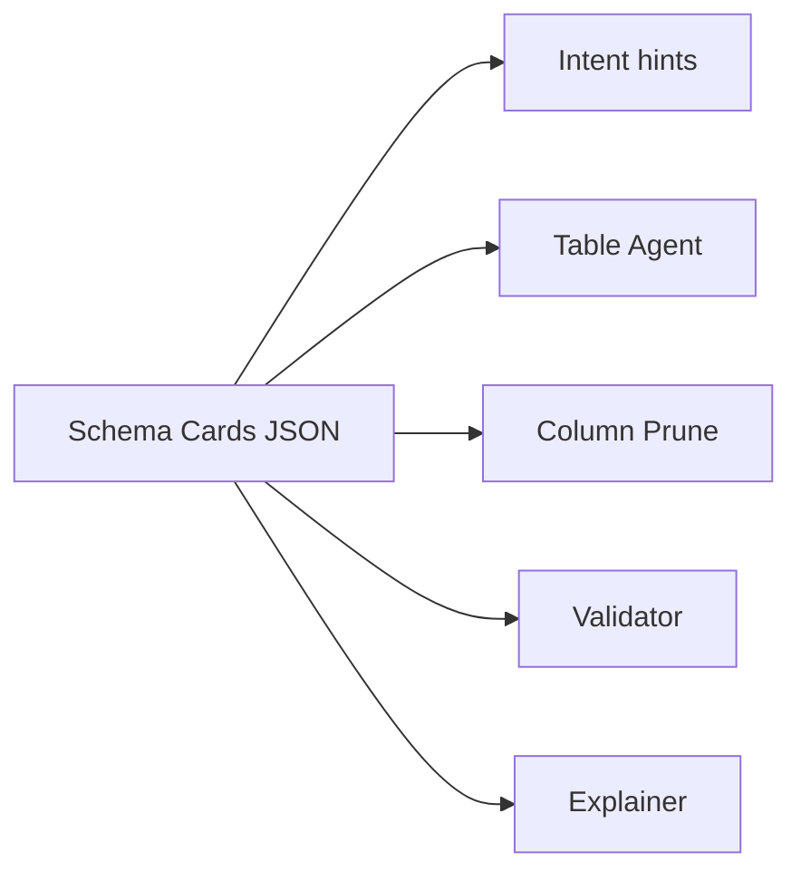
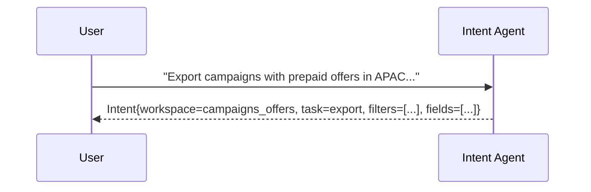
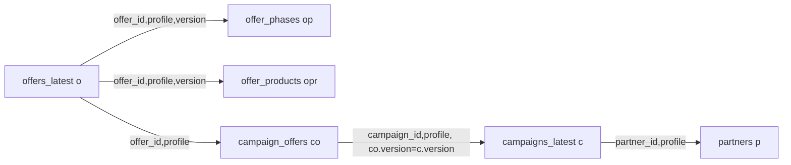
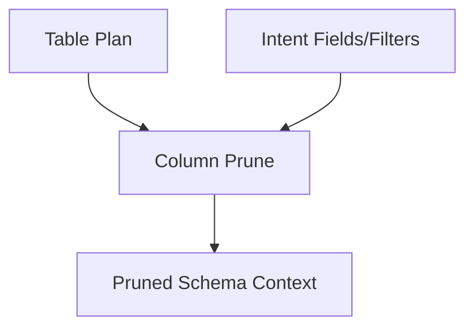
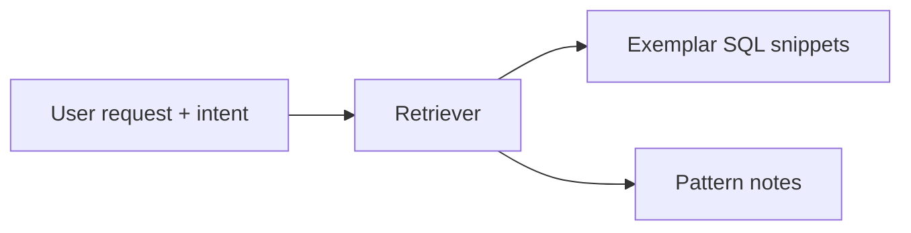
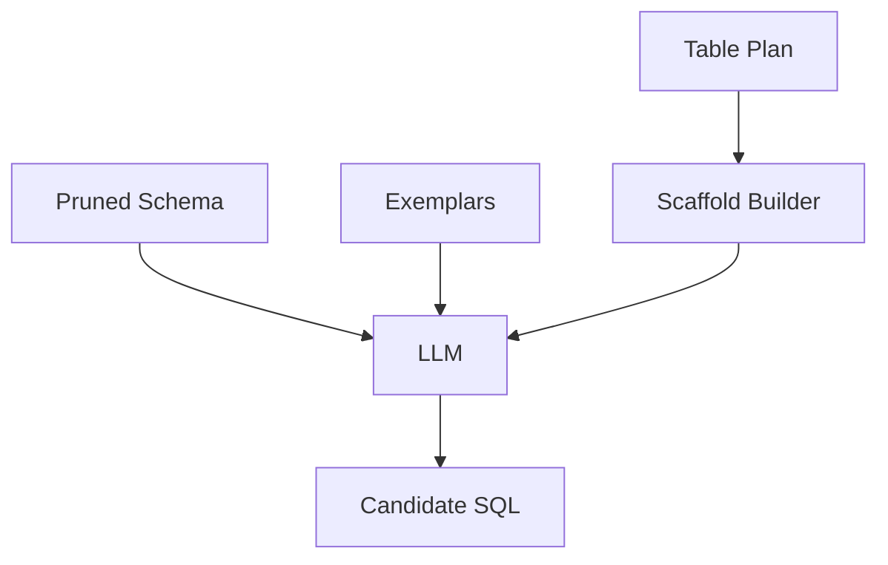
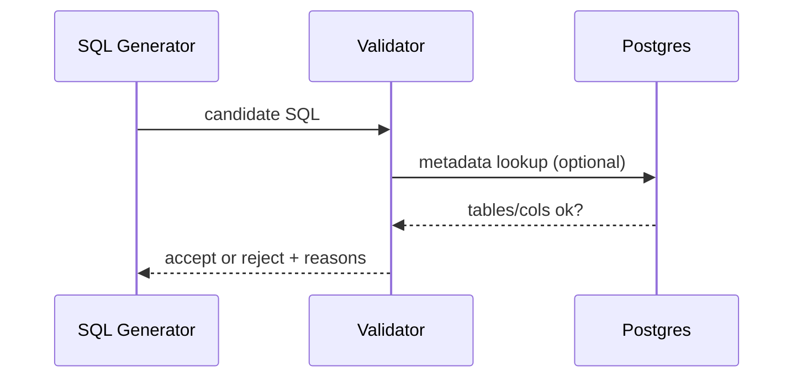
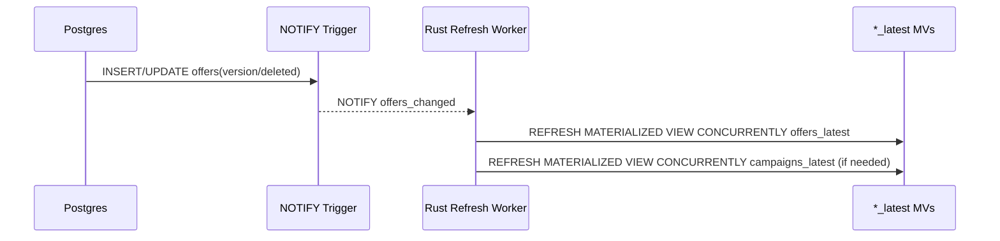

# Genie DB — QueryGPT-Style Text-to-SQL System (Expanded)
## Rust-first design + graphical component interactions

_Last updated: 2025-12-17_

This document expands the “QueryGPT full design” into an implementation-level guide suitable for a **Rust** codebase. It includes **graphical (Mermaid) diagrams** and a single end-to-end example that demonstrates the role of each component.

> Assumptions:
> - Genie DB entities are **versioned** by `(id, profile, version)`.
> - You maintain **latest materialized views**: `offers_latest`, `campaigns_latest`, `products_latest`, `discounts_latest`, `skus_latest`.
> - **Deleted rows are NOT filtered out** from `*_latest` — if the newest version is deleted, it is still the latest truth.
> - Version ownership differs by table type (offer satellites vs campaign link tables).

---

## 0) Running example (used throughout)

### User request (natural language)
> Export all **Campaigns** that have **Pre-Paid** offers. Put **Partnership ID** in the first column. Include Campaign ID + Campaign Name + Offer ID + Offer Name + Product(s) + PackageId + Country(s). Countries are APAC only (KR, JP, TW, SG, HK). Include Offers that are Published or Expired, and show “Expired or Live” based on end_date.

### What correctness means in Genie DB
- Offer head data comes from **latest offer version** → `offers_latest`.
- Campaign head data comes from **latest campaign version** → `campaigns_latest`.
- Offer satellites join on **offer version**:
  - `offer_phases` join on `(offer_id, profile, version)`
  - `offer_products` join on `(offer_id, profile, version)`
- `campaign_offers` is special:
  - its `version` is aligned to the **campaign version**
  - join uses: `campaign_offers.version = campaigns_latest.version` (not the offer version)

---

## 1) End-to-end architecture

```mermaid
flowchart TD
  U[User prompt] --> IA[Intent Agent]
  IA --> WR[Workspace Resolver]
  WR --> SC[Schema Cards + Join Graph]
  SC --> TA[Table Agent]
  TA --> CPA[Column Prune Agent]
  CPA --> RAG["Retriever (Exemplars + Docs)"]
  RAG --> SG["SQL Generator (LLM + deterministic scaffold)"]
  SG --> VAL[Static Validator]
  VAL --> EXP[Explainer]
  EXP --> EXE[Query Executor]
  EXE --> OUT[Rows / CSV Export]

  subgraph Ops["Ops / Freshness"]
    DB[(Genie DB)]
    MV[Latest MVs: *_latest]
    TR[DB NOTIFY Triggers]
    WK[Refresh Worker (Rust)]
    DB --> MV
    DB --> TR
    TR --> WK
    WK --> MV
  end

  EXE --> DB
  SC -. reads .-> MV
```

### Key idea
The LLM is not “discovering” your database. Instead:
- **Workspaces** bound the problem
- **Schema Cards** provide structured context
- **Join Graph** enforces safe, version-correct joins
- **RAG exemplars** provide consistent query patterns
- **Validator** blocks unsafe or incorrect SQL

---

## 2) Workspace design

A **Workspace** is a curated, domain-specific unit that contains:
- entity allowlist (tables/views/MVs)
- join graph (whitelisted join edges)
- derived fields catalogue
- exemplar SQL library

### Example Workspace: `campaigns_offers`
Entity heads:
- `offers_latest`
- `campaigns_latest`
- `products_latest` (optional depending on report fields)

Satellites / links:
- `offer_phases` (offer-owned versions)
- `offer_products` (offer-owned versions)
- `campaign_offers` (campaign-owned versions)
- `partners`

**Why it matters:** it prevents the LLM from pulling unrelated tables or inventing joins.

---

## 3) Schema Cards JSON + Join Graph

Schema Cards are the structured source of truth used by multiple components.

### What Schema Cards include
- table/view/MV columns, types, descriptions
- key constraints and join keys
- JSON path hints (e.g., `attributes.packageId`)
- filter patterns (countries overlap, phase_type, statuses)
- join edges + safety notes
- derived fields definitions



**Rust tip:** treat Schema Cards as versioned config checked into git. Add CI tests validating that join edges cover expected report shapes.

---

## 4) Intent Agent

### Input
- user prompt text

### Output (structured intent)
- `workspace`: `campaigns_offers`
- `task`: `export`
- `entities`: campaign, offer, partner, products
- `filters`: prepaid, APAC countries, statuses
- `fields`: partnership_id first, etc.



**Implementation approach (Rust):**
- Start with rules + keyword maps (fast, deterministic)
- Add embedding-based semantic classification later (optional)

---

## 5) Table Agent (the “version correctness” gate)

The Table Agent chooses tables and produces a version-safe join plan.

### Golden rules
- Entity heads always use `*_latest`.
- Offer satellites match **offer version**.
- Campaign link `campaign_offers.version` matches **campaign latest version**, not offer version.



### Why your earlier MV query returned 0 rows
When you constrained `co.version = o.version`, you implicitly assumed link-table version tracked offers. It likely tracks campaigns, which collapses matches to zero.

---

## 6) Column Prune Agent

The Column Prune Agent shrinks schema inputs to reduce LLM cost and reduce mistakes.

### For the running example, pruned columns might be
- `offers_latest`: `id,name,status,end_date,countries,attributes->>'packageId',profile,version`
- `offer_phases`: `legacy->>'phase_type'` + join keys
- `offer_products`: `product_id` + join keys
- `campaign_offers`: `campaign_id,offer_id,profile,version`
- `campaigns_latest`: `id,name,partner_id,profile,version`
- `partners`: `id,profile`



---

## 7) Retriever (RAG over exemplars)

RAG fetches SQL examples and patterns closest to the request.

### Inputs
- prompt
- workspace
- pruned schema summary

### Outputs
- 2–4 exemplar SQL snippets
- pattern notes (countries overlap, prepaid phase type, group-by conventions)



**Rust note:** start with keyword + BM25 over exemplars; upgrade to vector search when ready.

---

## 8) SQL Generator (deterministic scaffold + LLM fill)

High reliability approach:
1. deterministic scaffold renders FROM/JOIN clauses from the Table Plan
2. LLM fills SELECT fields + WHERE filters + GROUP BY
3. validator enforces correctness



**Key instruction to the LLM:** do not invent joins or columns—use provided aliases and allowed fields only.

---

## 9) Static Validator

The validator blocks unsafe or incorrect queries before execution.

### Recommended checks
- Read-only (no writes/DDL)
- Only allow entities from workspace allowlist
- Joins must match Join Graph edges
- Version correctness rules:
  - offer satellites join on offer version
  - campaign_offers version must align to campaign version
- Column existence
- GROUP BY correctness
- Add `LIMIT` unless explicit export mode



---

## 10) Explainer

Transforms the final SQL into a human explanation:
- what tables were used and why
- which filters were applied
- derived fields meaning
- where “latest” semantics come from

This is crucial for user trust and fast iteration.

---

## 11) Executor

Runs SQL safely:
- read-only DB role
- statement timeout
- streaming results for large exports
- export to CSV if needed

---

## 12) Freshness: keeping *_latest MVs up to date

Postgres materialized views don’t auto-refresh. Recommended approach:

- DB triggers emit `NOTIFY <entity>_changed` on insert/update of `version`/`deleted`
- A Rust worker LISTENs, debounces, and refreshes affected MVs using `CONCURRENTLY`



**Why not refresh inside triggers?** `REFRESH ... CONCURRENTLY` cannot run inside a transaction block and would block writers.

---

## 13) Final SQL for the running example (illustrative)

```sql
SELECT
  p.id AS partnership_id,
  c.id AS campaign_id,
  c.name AS campaign_name,
  o.id AS offer_id,
  o.name AS offer_name,
  CASE WHEN o.end_date::date < CURRENT_DATE THEN 'EXPIRED' ELSE o.status END AS expired_or_live_status,
  o.status AS workflow_status,
  o.countries,
  STRING_AGG(DISTINCT opr.product_id, ',') AS products,
  o.attributes ->> 'packageId' AS package
FROM offers_latest o
JOIN offer_phases op
  ON op.offer_id = o.id AND op.profile = o.profile AND op.version = o.version
JOIN offer_products opr
  ON opr.offer_id = o.id AND opr.profile = o.profile AND opr.version = o.version
JOIN campaign_offers co
  ON co.offer_id = o.id AND co.profile = o.profile
JOIN campaigns_latest c
  ON c.id = co.campaign_id AND c.profile = co.profile AND co.version = c.version
LEFT JOIN partners p
  ON p.id = c.partner_id AND p.profile = c.profile
WHERE
  op.legacy::jsonb ->> 'phase_type' = 'PREPAID'
  AND o.countries && ARRAY['KR','JP','TW','SG','HK']
  AND o.status IN ('PUBLISHED','EXPIRED')
GROUP BY
  p.id, c.id, c.name, o.id, o.name, o.end_date, o.status, o.countries, o.attributes
ORDER BY
  p.id, c.id, o.id;
```

---

## 14) Implementation mapping (Rust modules)

Suggested mapping to your Rust repo skeleton:

- `querygpt-core`
  - `schema/` → Schema Cards structs + registry loader
  - `agents/intent.rs` → intent classification
  - `agents/table.rs` → table selection + join plan
  - `agents/column_prune.rs` → schema pruning
  - `rag/` → exemplar retrieval + prompt builder
  - `validate/` → sqlparser + schema-aware checks
  - `explain/` → explain output generation
  - `policy/` → read-only + allowlist enforcement

- `querygpt-server`
  - HTTP API: `/generate`, `/validate`, `/execute` (read-only)

- `querygpt-worker`
  - LISTEN/NOTIFY debounced MV refresher

---

## 15) Practical next steps

1. Add more Workspace configs (pricing, products/skus)
2. Expand Schema Cards coverage for all relevant entities
3. Implement Table Agent using Join Graph strictly (no ad-hoc joins)
4. Implement schema-aware Validator (pg_catalog lookups)
5. Add execution + CSV export mode (with row limits and approvals)

---
