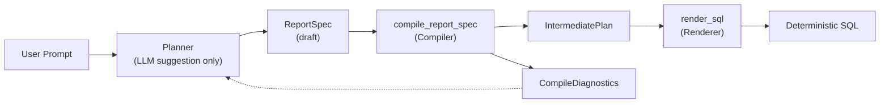
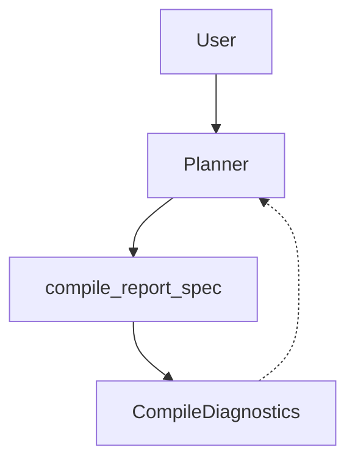

# Visualizing the Genie QueryGPT System (Mermaid)

This document provides a visual and narrative overview of the deterministic pipeline used in Genie QueryGPT and the planned feedback loop for Phase B. The diagrams are expressed in Mermaid for readability and portability.

## Deterministic Pipeline (Phase A)

A user's natural language request flows through several stages before becoming deterministic SQL. In Phase A, the pipeline is fully deterministic: the compiler controls all semantics, and the renderer simply serializes a canonical plan. Errors generate structured diagnostics that will be used during the planning loop.

### Key stages:

- **User Prompt**: A natural-language description of the desired report.

- **Planner (LLM suggestion only)**: In Phase B this component will map the prompt to a draft ReportSpec but never change SQL semantics.

- **ReportSpec (draft)**: Structured description of selected fields, filters, ordering and pagination.

- **compile_report_spec (Compiler)**: Validates the spec against the schema, resolves fields to entities, assigns deterministic aliases, builds safe join plans and returns a canonical IntermediatePlan.

- **IntermediatePlan**: Contains tables, joins, projections, filters, ordering and pagination in a deterministic form.

- **render_sql (Renderer)**: Serializes the plan into SQL without reinterpreting semantics.

- **Deterministic SQL**: Stable SQL string; the same input always yields the same output.

- **CompileDiagnostics**: Structured error messages with stable codes and context for unknown fields, invalid joins and other errors. These diagnostics feed back to the planner when planning is introduced.

## Planner Feedback Loop (Phase B)

Phase B introduces a bounded loop where the planner uses diagnostic feedback to improve its suggestions. The loop ensures that AI assistance is safe: the compiler always validates and the planner only suggests, never decides.

### Steps in the feedback loop:

1. **User ➜ Planner**: The user provides a prompt; the planner proposes a draft ReportSpec.

2. **Planner ➜ Compiler**: The draft spec is compiled. If valid, the system proceeds to the renderer; otherwise, diagnostics are generated.

3. **Compiler ➜ Diagnostics**: Structured diagnostics report the error type and context.

4. **Diagnostics ➜ Planner**: The planner receives diagnostic feedback, revises its draft and may ask the user for confirmation. The loop repeats until a valid plan is produced or a retry limit is reached.

## Summary

Genie QueryGPT separates planning (AI‑assisted suggestion) from compilation and rendering (deterministic and compiler‑enforced). The compile_report_spec and render_sql functions constitute the deterministic backbone, while the CompileDiagnostics system returns structured errors. The mermaid diagrams above capture the flow of data and the feedback loop that will enable safe AI assistance in Phase B.